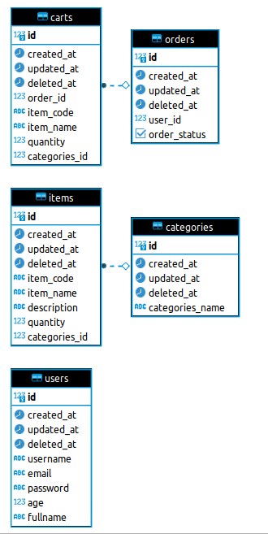

# SUPERINDO TEST CASE

Implement Model-View-Controller code pattern for given cases.
1. Create, Read, Update, Delete API for User Management with pagination and search query
2. Create, Read API for Product Category
3. Create, Read API for Order
4. Login mechanism
5. Using JWT

## Prerequisite
1. Docker and Docker compose
2. Go language version 1.17 +
3. Postgresql (Will run as docker container)
4. DBeaver (Database GUI)

## Entity Relation Diagram 


## How To Use
1. After all prerequisite installed, import Postman Collection
2. Exec ```make run-db``` to start docker container
3. Exec ```make run-app``` to start the application
4. Exec queries from ```queries.sql``` to your PostgreSQL command

## API Explaination
1. ```localhost:4123/users?email={email}&limit=10&offset=0``` 
2. Endpoint will search all data relate to the queries
3. ```localhost:4123/user/{:userID}```
4. Endpoint will get detail of user data
5. Password will stored with chiper text value.
6. API Create using GORM
7. Using auto migrate form GORM will create tables automatically (If not exist)